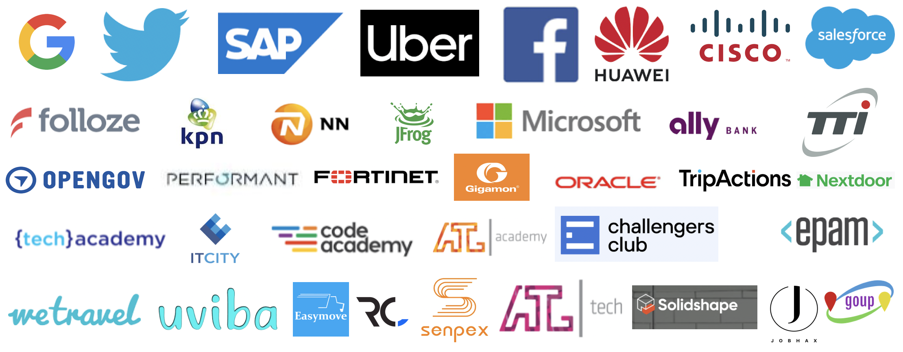
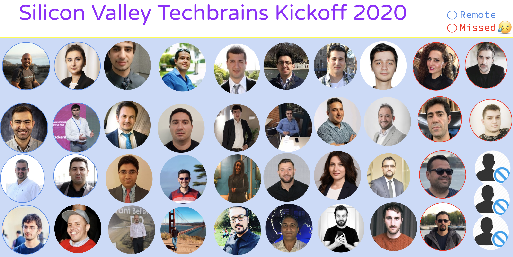
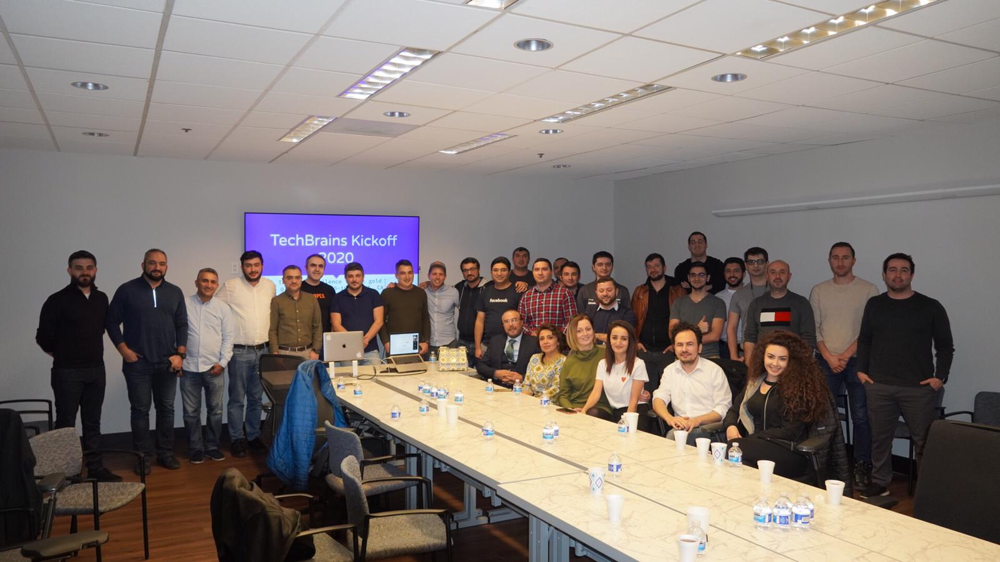
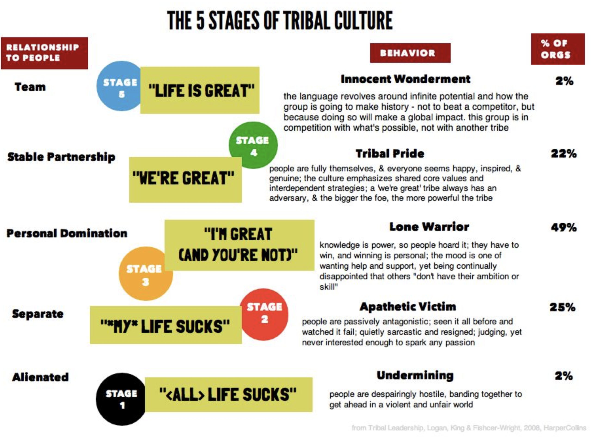

# Techbrains - "The moment silence is not gold …"

"Good intentions never work, you need good mechanisms to make anything happen." - Jeff Bezos

- [About Us](#about-us)
- [Contact](#Contact)

## Motivation
- Onboard Open Source community spirit
- Good Leaders talk about it
- People need your expertise, motivation, love

There are some problems, all of us can keep talking, complaining which involves changing mindsets. As example, getting away from sugar, or being vegetarian, or changing community culture. But, sometimes we can partially suceed if right approach is taken.

## Agenda
Engineers love build stuff, solve problems! There is another role, called Community Architects, shaping dream community.

So let’s shape it:

- Egoless, collaborative, competent,  decentralized, scalable, fun community culture
- Structured and indexed data flow within community

## NOT IN Agenda
- Politics
- Religion
- Immigration

## Timeline

All participants have 5mins and 1 slide to talk. Time keeping should be in place, make sure todo homework not exceed allocated time budget.

So, its up to participant creativity, some thoughts:

1. Who you are, what are things you care and interest
2. How can community help you, move faster in ladder
3. Any how, you would like give back to community (referral, guidance etc.)

## Techbrains - US 01/18/2020

Full Recording of the meeting: [Video](https://youtu.be/dVKLBccSDag)
Slides of the meeting:

|No| Name | Position | Company | Education | Attendance | Country |
|------|----------------------|---------|------|-----|------|------|
|1| [Sako M](https://www.linkedin.com/in/sakom/)|DevOps|OpenGov|MSc: ITU(US), Eurecom(France), Qafqaz Uni(Azerbaijan)|Onsite|USA|
|2| [Kanan Rahimov](https://www.linkedin.com/in/kananrahimov/)|Sr. SWE|KPN| State Oil Academy - CS - Baku|Missed|Netherlands|
|3| [Emin Aliyev](https://www.linkedin.com/in/eminfaliyev/)|CEO|Easymove|Baku State University - Applied Mathematics and Economic Cybernetics|[Remote|USA|
|4| [Jahangir Najafov](https://www.linkedin.com/in/jahangirnajafov)|Product Tech Manager|Google|Duke University - Fuqua School of Business Baku State University|[Video]()|USA|
|5| [Ibrahim Hasanov](https://www.linkedin.com/in/uviba/)|Founder|Uviba|Qafqaz University (Dropout) Minerva Schools at K.G.I|[Video]()|USA|
|6|[Chimnaz Shahbazzade Mammadov](https://www.linkedin.com/in/chimnaz-shahbazzade)|Identity Operations|Twitter|Golden Gate University - International Law, SJD (PhD) 20 University of California, Berkeley - Business Law, LL.M. Baku State University - International Law, LL.B., LL.M|[Video]()|USA|
|7| [Orkhan Gasimli]( https://www.linkedin.com/in/ogasimli)|SWE II|Uber|	University of Cologne - Business Law, LL.M. Baku State University - Business Law, LL.B.|[Video]()|USA|
|8| [Vusal Ibrahimli](https://www.linkedin.com/in/vgasim/)|Financial Analyst III| Facebook|Data Analysis, Stanford Continuing Studies; MBA, Khazar University, Azerbaijan BA, Economics, Special Talent’s Group,Azerbaijan State University of Economics (UNEC |[Video]()|USA|
|9| [Kamil Rasulov](https://www.linkedin.com/in/kamil-rasulov-5b913b127/ )|DevOps|SAP|BA Qafqaz University (Computer Engineering)|[Video]()|USA|
|10| [Javidan Guliyev](https://www.linkedin.com/in/javidang/)|SDE II|Performant|Baku State University - CS|[Video]()|USA|
|11|[Emil Khaligov](https://www.linkedin.com/in/emil-khaligov-7181a15b/)|Tech Support contract|Huawei| Azerbaijan Economy University|[Video]()|USA|
|12|[Farhad Alakbarov](https://www.linkedin.com/in/farikus/)|Founder|Hooqa|B.E. Azerbaijan Technical University|[Video](https://www.youtube.com/watch?v=Kvr1S4USXOI)|USA|
|13|[Ziya Karimov](https://www.linkedin.com/in/ziyakerimov/)|Tech Support Engineer|Fortinet|National Aviation Academy|[Video](https://www.youtube.com/watch?v=Kvr1S4USXOI)|USA|
|14|[Mikayil Gasimov](https://www.linkedin.com/in/mikayil-gasimov-61859b21)|Sr Manager Network Systems|Gigamon|BA Computer Engineering, East Ukrainian Volodymyr Dahl National University|[Video]()|USA|
|15|[Mahir Afandiyev](https://www.linkedin.com/in/mahirafandiyev/)|Cloud Database SRE|Oracle|Baku State University - Applied Mathematics|[Video]()|USA|
|16|[Mahammadiya Abdurahimov](https://www.linkedin.com/in/mahammadiya/)|Sr. SWE|Tripactions|Hacettepe University - Software Engineer - Ankara, Turkey|[Video]()|USA|
|17|[Ayka Agayeva](https://www.linkedin.com/in/ayka.agayeva/)|IT Manager|Google|B.S.: University of Texas in Arlington (TX, USA); American University(Baku)|[Video]()|USA|

© 2020 GOUP. All Rights Reserved.

## Use Cases

### UC01 - Delicious food & Successful career 

#### Requirements
- Knowledge & experience = ingredients
- The money spend on ingredients = health variables(late sleep, long work hours etc.), time and cost(spend on trainings, commute etc.)

#### Conclusion
- Right receipt makes food delicious! 
  - Which ingredient in which quality = X technology in junior level
  - Which ingredient what time = X coding language, after Y one
  - Which ingredient how much = 2 years in X company
  
### UC02 - Tribal Leadership
There are 5 stages of community mindset:
- All life sucks
- My life sucks
- I am great, others suck
- We are great as community, others suck
- Life is great!

The success of community is measured, not based on individual level, but rather in which stage the majority are:

Note: For great TedTalk please check this [link](https://www.youtube.com/watch?v=xTkKSJSqU-I)

## About Us

### Who we are?
The GOUP project is the idea of a Azeri tech community living abroad.

### Mission
Build bridges between tech professionals in a collaborative ways across the borders.

### Vision
Make the world better place to live, using technology and right culture.

### Objectives
Build egoless, collaborative, competent,  decentralized, scalable, fun community culture.
Our goal is simple to structure and index the data flow within communities. 

## Contact
You can contact us via:

Slack Workspace: https://goupaz.slack.com

To join us in Slack: [link](https://join.slack.com/t/goupaz/shared_invite/enQtMjU1MjM5MDc2MzQxLWJkMTZiMGFhZDA3ZDkwZTgxMDNhMzc4YjFkZTBjZGMxZmQxYzA0NjEyMDM1ODVjMTBiYWUxN2UzMDVlNmYzMjU)

Youtube : https://www.youtube.com/goupaz

Facebook : https://www.facebook.com/goupaz

