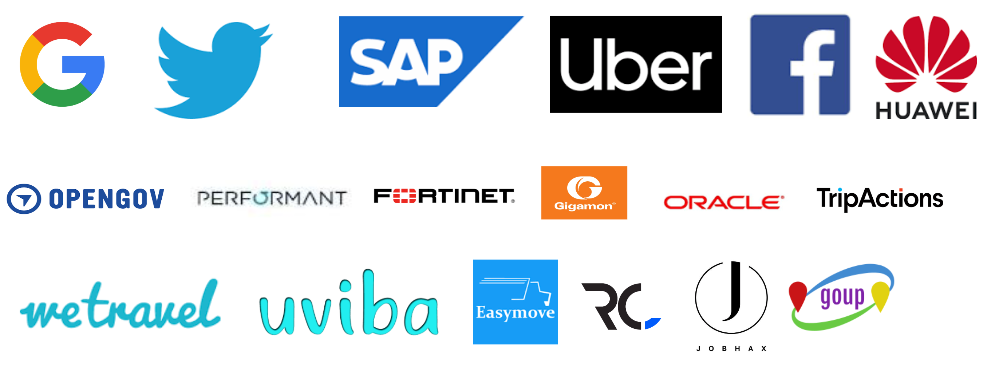

# Azerbaijani TechMentors living across the world

Welcome to new networking approach.

- [About Us](#aboutus)
- [Contact](#Contact)

## Techbrains - US 01/18/2020

|No| Name | Position | Company | Education |Linkedin| Video | Country |
|------|----------------------|---------|---|-----|-----|------|------|
|1| Sako M|DevOps|OpenGov|MSc: ITU(US), Eurecom(France), Qafqaz Uni(Azerbaijan)|[Link](https://www.linkedin.com/in/sakom/)|[Video](https://www.youtube.com/watch?v=Kvr1S4USXOI)|USA|

© 2019 GOUP. All Rights Reserved.

## About Us

### Who we are?
The GOUP project is the idea of a team of experienced and experienced IT teams living abroad. The main goal of the project is to develop Open Source resources in Azerbaijan and to share with you the experience gained abroad.

### Mission
Build bridges between our IT and IT professionals in foreign and local markets.

### Vision
Preparation of Azerbaijani youth to enter foreign markets.  
Development of Local Startup Infrastructure
We bring latest technology updates to you 

### Objectives
Our goal is simple to accelerate the development of the IT industry and reach the largest audience.

## Contact
You can contact us via:

Slack : https://goupaz.slack.com

To join Slack! [link](https://join.slack.com/t/goupaz/shared_invite/enQtMjU1MjM5MDc2MzQxLWJkMTZiMGFhZDA3ZDkwZTgxMDNhMzc4YjFkZTBjZGMxZmQxYzA0NjEyMDM1ODVjMTBiYWUxN2UzMDVlNmYzMjU)

Youtube : https://www.youtube.com/goupaz

Facebook : https://www.facebook.com/goupaz

